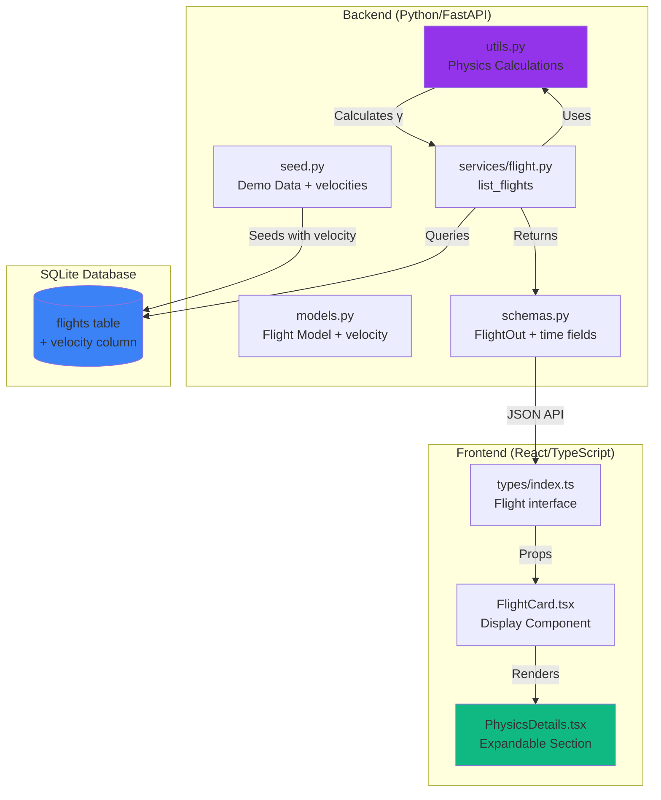
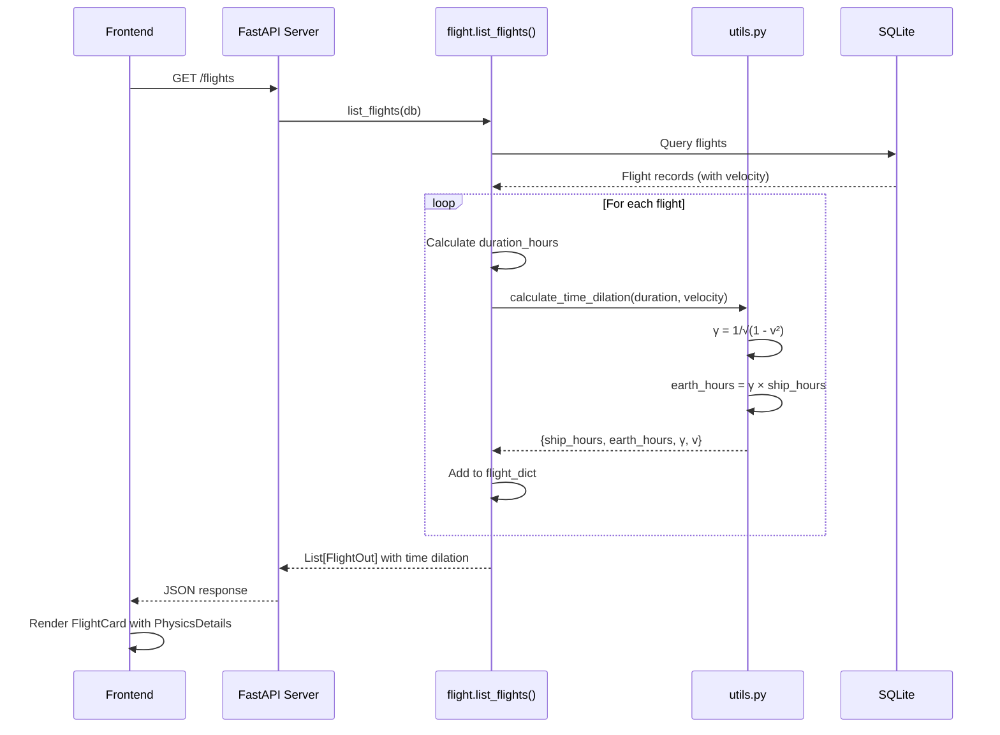
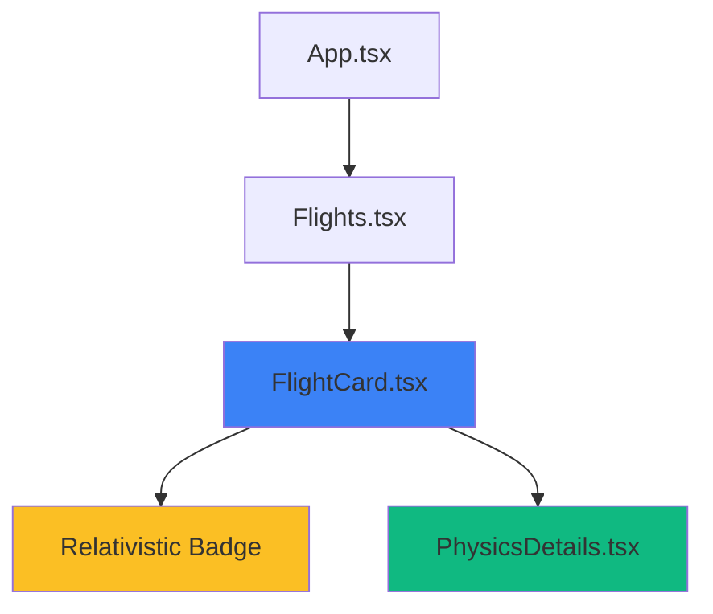

# Project Chronos: Architecture & Data Flow

## System Architecture



## Data Flow: Time Dilation Calculation



## Component Hierarchy



## Database Schema Changes

### Before (Current)
```sql
CREATE TABLE flights (
    flight_id INTEGER PRIMARY KEY,
    origin TEXT NOT NULL,
    destination TEXT NOT NULL,
    departure_time TEXT NOT NULL,
    arrival_time TEXT NOT NULL,
    base_price INTEGER NOT NULL,
    economy_seats_available INTEGER NOT NULL,
    business_seats_available INTEGER NOT NULL,
    galaxium_seats_available INTEGER NOT NULL
);
```

### After (With Project Chronos)
```sql
CREATE TABLE flights (
    flight_id INTEGER PRIMARY KEY,
    origin TEXT NOT NULL,
    destination TEXT NOT NULL,
    departure_time TEXT NOT NULL,
    arrival_time TEXT NOT NULL,
    base_price INTEGER NOT NULL,
    economy_seats_available INTEGER NOT NULL,
    business_seats_available INTEGER NOT NULL,
    galaxium_seats_available INTEGER NOT NULL,
    velocity REAL NOT NULL DEFAULT 0.0  -- NEW: v/c ratio
);
```

## API Response Changes

### Before
```json
{
  "flight_id": 1,
  "origin": "Earth",
  "destination": "Mars",
  "departure_time": "2099-01-01T09:00:00Z",
  "arrival_time": "2099-01-01T17:00:00Z",
  "base_price": 1000000,
  "economy_seats_available": 6,
  "business_seats_available": 3,
  "galaxium_seats_available": 1,
  "economy_price": 1000000,
  "business_price": 2500000,
  "galaxium_price": 5000000
}
```

### After (With Time Dilation)
```json
{
  "flight_id": 1,
  "origin": "Earth",
  "destination": "Mars",
  "departure_time": "2099-01-01T09:00:00Z",
  "arrival_time": "2099-01-01T17:00:00Z",
  "base_price": 1000000,
  "economy_seats_available": 6,
  "business_seats_available": 3,
  "galaxium_seats_available": 1,
  "economy_price": 1000000,
  "business_price": 2500000,
  "galaxium_price": 5000000,
  "velocity": 0.55,
  "lorentz_factor": 1.198,
  "ship_duration_hours": 8.0,
  "earth_duration_hours": 9.58
}
```

## Frontend UI Layout

```
┌─────────────────────────────────────────────────────┐
│ FlightCard                                          │
├─────────────────────────────────────────────────────┤
│ 🚀 Earth → Mars                    Flight #1        │
│                                                     │
│ Departure: Jan 01, 2099  │  Arrival: Jan 01, 2099  │
│ 09:00                    │  17:00                  │
│                                                     │
│ ⏱️ Duration: 8h          [⚡ Relativistic Speed]   │ ← Badge if v>0.7
│                                                     │
│ ┌─ Physics Details ▼ ─────────────────────────┐   │ ← Expandable
│ │ Velocity: 55% of light speed                │   │
│ │ Lorentz Factor (γ): 1.20                    │   │
│ │                                              │   │
│ │ Time Dilation Effect:                        │   │
│ │ • Ship Time: 8.0 hours                       │   │
│ │ • Earth Time: 9.6 hours                      │   │
│ │                                              │   │
│ │ ℹ️ For every 1 hour onboard, 1.2 hours      │   │
│ │    pass on Earth due to relativistic speed   │   │
│ └──────────────────────────────────────────────┘   │
│                                                     │
│ [Economy] [Business] [Galaxium Class]              │
└─────────────────────────────────────────────────────┘
```

## Physics Calculation Example

### Input
- Route: Earth → Mars
- Departure: 2099-01-01 09:00
- Arrival: 2099-01-01 17:00
- Velocity: 0.55c (55% of light speed)

### Calculation Steps

1. **Calculate Duration**
   ```
   duration = arrival - departure = 8 hours
   ```

2. **Calculate Lorentz Factor**
   ```
   γ = 1 / √(1 - v²/c²)
   γ = 1 / √(1 - 0.55²)
   γ = 1 / √(1 - 0.3025)
   γ = 1 / √0.6975
   γ = 1 / 0.8352
   γ ≈ 1.198
   ```

3. **Calculate Time Dilation**
   ```
   ship_time = 8 hours (proper time)
   earth_time = γ × ship_time
   earth_time = 1.198 × 8
   earth_time ≈ 9.58 hours
   ```

4. **Result**
   - Travelers experience: 8 hours
   - Earth observers measure: 9.58 hours
   - Time dilation ratio: 1.2:1

## File Dependencies

```
booking_system_backend/
├── utils.py (NEW)                    ← Physics calculations
│   └── Used by: services/flight.py
├── models.py (MODIFIED)              ← Add velocity column
│   └── Used by: seed.py, services/
├── schemas.py (MODIFIED)             ← Add time dilation fields
│   └── Used by: server.py, services/
├── services/flight.py (MODIFIED)     ← Compute time dilation
│   └── Uses: utils.py
├── seed.py (MODIFIED)                ← Add velocity to demo data
└── tests/
    └── test_utils.py (NEW)           ← Test physics functions

booking_system_frontend/
├── src/types/index.ts (MODIFIED)     ← Add time dilation fields
├── src/components/flights/
│   ├── FlightCard.tsx (MODIFIED)     ← Add badge & physics section
│   └── PhysicsDetails.tsx (NEW)      ← Expandable details component
```

## Implementation Order

1. **Backend Foundation** (Steps 1-4)
   - Create utils.py with physics functions
   - Update models.py with velocity column
   - Update schemas.py with new fields
   - Modify services/flight.py to use utils

2. **Data Layer** (Steps 5-6)
   - Update seed.py with velocities
   - Create test_utils.py

3. **Frontend Integration** (Steps 7-10)
   - Update TypeScript types
   - Create PhysicsDetails component
   - Modify FlightCard component
   - Add styling

4. **Documentation** (Step 11)
   - Create PROJECT_CHRONOS.md

## Testing Checklist

- [ ] Physics calculations are accurate
- [ ] Edge cases handled (v=0, v→1)
- [ ] Database seeds with velocities
- [ ] API returns time dilation fields
- [ ] Frontend displays physics data
- [ ] Expandable section works
- [ ] Badge shows for v>0.7
- [ ] Mobile responsive
- [ ] No breaking changes

---

**Status**: Ready for implementation in Code mode