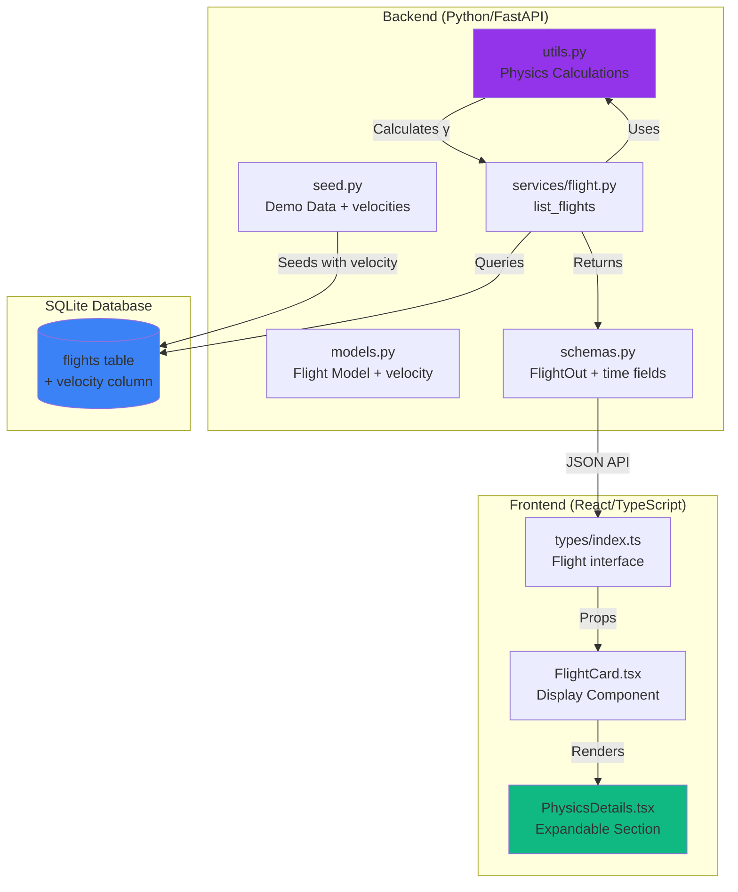
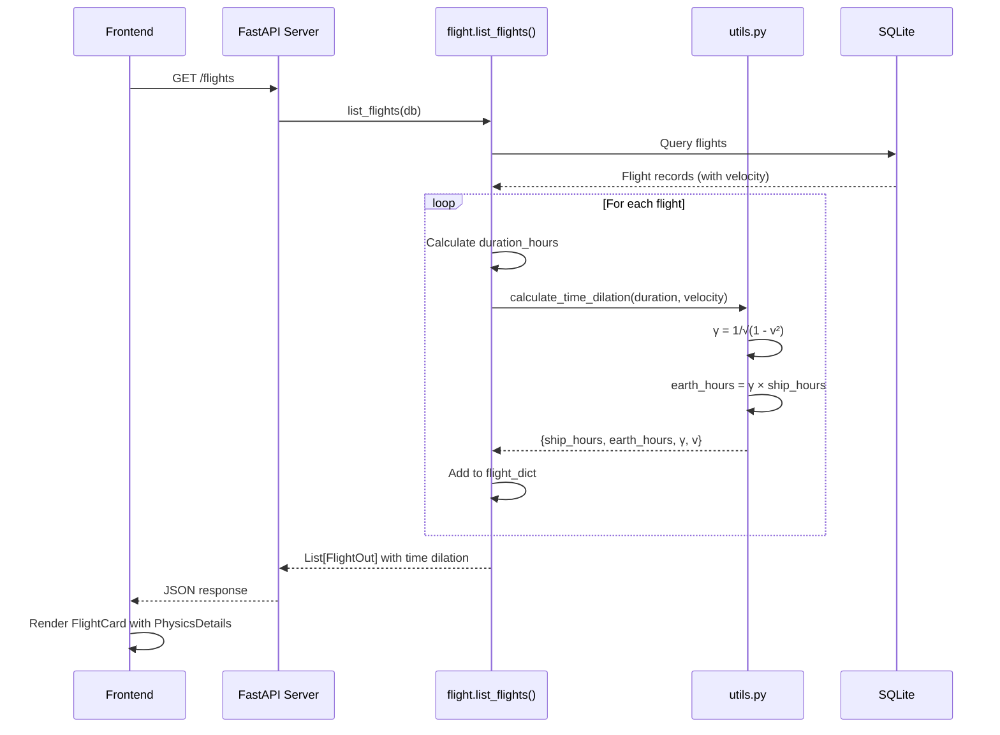
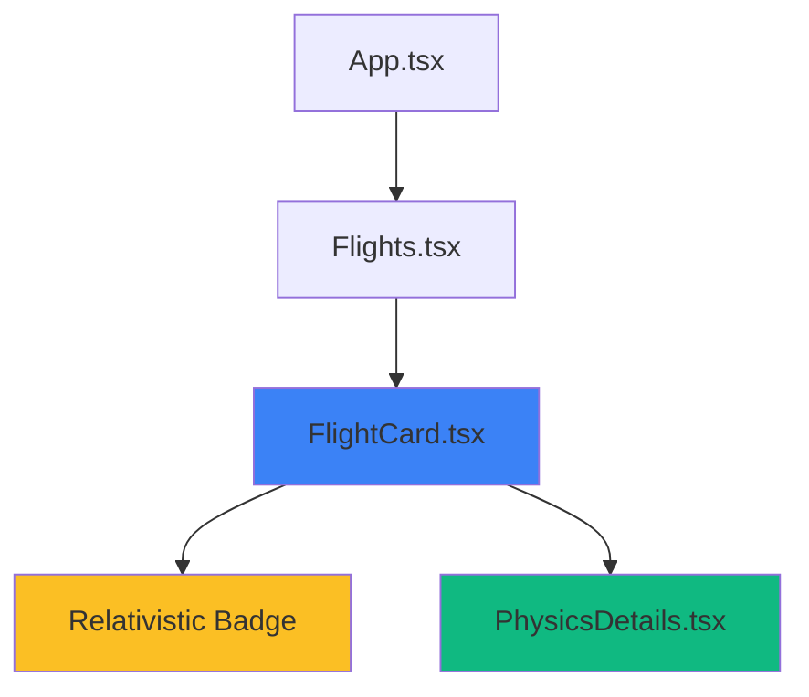

**User:**

<task>
Bob, let's implement the heart of Project Chronos.I want to add a utility function to the booking_system_backend that calculates the Lorentz factor ($\gamma$) using this formula:$$ \gamma = \frac{1}{\sqrt{1 - \frac{v^2}{c^2}}} $$This will help travelers understand how much 'Earth-time' passes for every hour they spend on their ship based on their velocity ($v$). Please find the best file to add this math and show me a plan to integrate it into the flight details.
</task>
<environment_details>
# VSCode Visible Files
.bob\rules-plan\AGENTS.md

# VSCode Open Tabs
.bob/rules-code/AGENTS.md,.bob/rules-advanced/AGENTS.md,.bob/rules-ask/AGENTS.md,.bob/rules-plan/AGENTS.md

# Current Time
Current time in ISO 8601 UTC format: 2026-05-01T16:49:41.481Z
User time zone: Asia/Dhaka, UTC+6:00

# Current Cost
$0.00

# Review Exclusions
The following file patterns are excluded from code reviews:
- .vscode/**

# Current Mode
<slug>plan</slug>
<name>📝 Plan</name>


# Current Workspace Directory (c:/Users/Asus/Documents/galaxium-travels) Files
.gitignore
AGENTS.md
docker-compose.yml
LICENSE
pyrightconfig.json
README.md
start.sh
bob_sessions/
booking_system_backend/
booking_system_backend/.dockerignore
booking_system_backend/db.py
booking_system_backend/Dockerfile
booking_system_backend/models.py
booking_system_backend/pytest.ini
booking_system_backend/README.md
booking_system_backend/requirements.txt
booking_system_backend/schemas.py
booking_system_backend/seed.py
booking_system_backend/server.py
booking_system_backend/services/
booking_system_backend/services/__init__.py
booking_system_backend/services/booking.py
booking_system_backend/services/flight.py
booking_system_backend/services/user.py
booking_system_backend/tests/
booking_system_backend/tests/__init__.py
booking_system_backend/tests/conftest.py
booking_system_backend/tests/test_rest.py
booking_system_backend/tests/test_services.py
booking_system_frontend/
booking_system_frontend/.dockerignore
booking_system_frontend/.env.example
booking_system_frontend/.gitignore
booking_system_frontend/Dockerfile
booking_system_frontend/eslint.config.js
booking_system_frontend/index.html
booking_system_frontend/nginx.conf
booking_system_frontend/package-lock.json
booking_system_frontend/package.json
booking_system_frontend/postcss.config.js
booking_system_frontend/README.md
booking_system_frontend/tailwind.config.js
booking_system_frontend/tsconfig.app.json
booking_system_frontend/tsconfig.json
booking_system_frontend/tsconfig.node.json
booking_system_frontend/vite.config.ts
booking_system_frontend/public/
booking_system_frontend/public/vite.svg
booking_system_frontend/src/
booking_system_frontend/src/App.css
booking_system_frontend/src/App.tsx
booking_system_frontend/src/index.css
booking_system_frontend/src/main.tsx
booking_system_frontend/src/vite-env.d.ts
booking_system_frontend/src/assets/
booking_system_frontend/src/assets/react.svg
booking_system_frontend/src/components/
booking_system_frontend/src/components/bookings/
booking_system_frontend/src/components/bookings/BookingCard.tsx
booking_system_frontend/src/components/bookings/BookingModal.tsx
booking_system_frontend/src/components/bookings/HoldCard.tsx
booking_system_frontend/src/components/common/
booking_system_frontend/src/components/common/Button.tsx
booking_system_frontend/src/components/common/Card.tsx
booking_system_frontend/src/components/common/index.ts
booking_system_frontend/src/components/common/Input.tsx
booking_system_frontend/src/components/common/LoadingSpinner.tsx
booking_system_frontend/src/components/common/Modal.tsx
booking_system_frontend/src/components/common/Starfield.tsx
booking_system_frontend/src/components/flights/
booking_system_frontend/src/components/flights/FlightCard.tsx
booking_system_frontend/src/components/flights/FlightFilters.tsx
booking_system_frontend/src/components/layout/
booking_system_frontend/src/components/layout/Footer.tsx
booking_system_frontend/src/components/layout/Header.tsx
booking_system_frontend/src/components/layout/Layout.tsx
booking_system_frontend/src/components/user/
booking_system_frontend/src/components/user/UserIdentification.tsx
booking_system_frontend/src/hooks/
booking_system_frontend/src/hooks/useUser.tsx
booking_system_frontend/src/pages/
booking_system_frontend/src/pages/Flights.tsx
booking_system_frontend/src/pages/Home.tsx
booking_system_frontend/src/pages/MyBookings.tsx
booking_system_frontend/src/services/
booking_system_frontend/src/services/api.ts
booking_system_frontend/src/types/
booking_system_frontend/src/types/index.ts
booking_system_frontend/src/utils/
booking_system_frontend/src/utils/formatters.ts
booking_system_frontend/src/utils/holdStorage.ts
booking_system_inventory_hold_service/
deployment_scripts/
deployment_scripts/README.md
deployment_scripts/aws/
deployment_scripts/aws/deploy-to-aws.sh
deployment_scripts/aws/scale-to-zero.sh
deployment_scripts/aws/scale-up.sh
deployment_scripts/aws/teardown-aws.sh
deployment_scripts/ibm/
deployment_scripts/ibm/check-ibm-status.sh
deployment_scripts/ibm/deploy-to-ibm-simple.sh
deployment_scripts/ibm/deploy-to-ibm.sh
deployment_scripts/ibm/teardown-ibm.sh
deployment_scripts/local/
deployment_scripts/local/start_locally.sh
deployment_scripts/local/test-containers.sh
deployment_scripts/terraform/
deployment_scripts/terraform/.gitignore
deployment_scripts/terraform/.terraform.lock.hcl
deployment_scripts/terraform/alb.tf
deployment_scripts/terraform/autoscaling.tf
deployment_scripts/terraform/cloudwatch.tf
deployment_scripts/terraform/ecr.tf
deployment_scripts/terraform/ecs.tf
deployment_scripts/terraform/iam.tf
deployment_scripts/terraform/main.tf
deployment_scripts/terraform/outputs.tf
deployment_scripts/terraform/rds.tf
deployment_scripts/terraform/README.md
deployment_scripts/terraform/security_groups.tf
deployment_scripts/terraform/terraform.tfvars.example
deployment_scripts/terraform/variables.tf
deployment_scripts/terraform/vpc.tf
You have not created a todo list yet. Create one with `update_todo_list` if your task is complicated or involves multiple steps.
</environment_details>

---

**Assistant:**

I'll help you implement the Lorentz factor calculation for Project Chronos! Let me first gather some context about the current backend structure to find the best place for this utility function.

<read_file>
<args>
  <file>
    <path>booking_system_backend</path>
  </file>
  <file>
    <path>booking_system_backend/models.py</path>
  </file>
  <file>
    <path>booking_system_backend/schemas.py</path>
  </file>
  <file>
    <path>booking_system_backend/services/flight.py</path>
  </file>
  <file>
    <path>booking_system_frontend/src/types/index.ts</path>
  </file>
</args>
</read_file>

---

**User:**

[read_file for 5 files] Result:
<files>
<file><path>booking_system_backend</path><error>File not found</error><notice>The file was not found. Consider using list_files to find available files before attempting to read them.</notice></file>
<file><path>booking_system_backend/models.py</path>
<content lines="1-39">
 1 | from enum import Enum
 2 | from sqlalchemy import Column, Integer, String, ForeignKey
 3 | from sqlalchemy.ext.declarative import declarative_base
 4 | 
 5 | Base = declarative_base()
 6 | 
 7 | class BookingStatus(str, Enum):
 8 |     BOOKED = "booked"
 9 |     CANCELLED = "cancelled"
10 |     CANCELED = "cancelled"  # American spelling alias
11 |     COMPLETED = "completed"
12 | 
13 | class User(Base):
14 |     __tablename__ = 'users'
15 |     user_id = Column(Integer, primary_key=True, index=True, autoincrement=True)
16 |     name = Column(String, nullable=False)
17 |     email = Column(String, unique=True, nullable=False)
18 | 
19 | class Flight(Base):
20 |     __tablename__ = 'flights'
21 |     flight_id = Column(Integer, primary_key=True, index=True, autoincrement=True)
22 |     origin = Column(String, nullable=False)
23 |     destination = Column(String, nullable=False)
24 |     departure_time = Column(String, nullable=False)
25 |     arrival_time = Column(String, nullable=False)
26 |     base_price = Column(Integer, nullable=False)  # Economy price (1x)
27 |     economy_seats_available = Column(Integer, nullable=False)  # 60% of total
28 |     business_seats_available = Column(Integer, nullable=False)  # 30% of total
29 |     galaxium_seats_available = Column(Integer, nullable=False)  # 10% of total
30 | 
31 | class Booking(Base):
32 |     __tablename__ = 'bookings'
33 |     booking_id = Column(Integer, primary_key=True, index=True, autoincrement=True)
34 |     user_id = Column(Integer, ForeignKey('users.user_id'), nullable=False)
35 |     flight_id = Column(Integer, ForeignKey('flights.flight_id'), nullable=False)
36 |     status = Column(String, nullable=False)
37 |     booking_time = Column(String, nullable=False)
38 |     seat_class = Column(String, nullable=False, default='economy')  # economy/business/galaxium
39 |     price_paid = Column(Integer, nullable=False)  # Actual price at booking time
</content>
</file>
<file><path>booking_system_backend/schemas.py</path>
<content lines="1-89">
 1 | from pydantic import BaseModel, EmailStr
 2 | from typing import Optional, Literal
 3 | 
 4 | # Seat class type definition
 5 | SeatClass = Literal['economy', 'business', 'galaxium']
 6 | 
 7 | 
 8 | class FlightQueryParams(BaseModel):
 9 |     """Query parameters for filtering and sorting flights."""
10 |     # Location filters (case-insensitive partial match)
11 |     origin: Optional[str] = None
12 |     destination: Optional[str] = None
13 |     
14 |     # Date range filters (format: YYYY-MM-DD)
15 |     departure_date_from: Optional[str] = None
16 |     departure_date_to: Optional[str] = None
17 |     
18 |     # Price range filters
19 |     min_price: Optional[int] = None
20 |     max_price: Optional[int] = None
21 |     
22 |     # Seat availability filters (at least 1 seat available)
23 |     has_economy: Optional[bool] = None
24 |     has_business: Optional[bool] = None
25 |     has_galaxium: Optional[bool] = None
26 |     
27 |     # Sorting
28 |     sort: Optional[Literal['price', 'departure_time', 'duration']] = None
29 |     order: Optional[Literal['asc', 'desc']] = 'asc'
30 | 
31 | 
32 | class FlightOut(BaseModel):
33 |     flight_id: int
34 |     origin: str
35 |     destination: str
36 |     departure_time: str  # Format: YYYY-MM-DD HH:MM
37 |     arrival_time: str    # Format: YYYY-MM-DD HH:MM
38 |     base_price: int  # Economy price (1x)
39 |     economy_seats_available: int
40 |     business_seats_available: int
41 |     galaxium_seats_available: int
42 |     # Computed prices for all classes
43 |     economy_price: int
44 |     business_price: int
45 |     galaxium_price: int
46 | 
47 |     class Config:
48 |         from_attributes = True
49 | 
50 | 
51 | class BookingRequest(BaseModel):
52 |     user_id: int
53 |     name: str
54 |     flight_id: int
55 |     seat_class: SeatClass = 'economy'  # Default to economy
56 | 
57 | 
58 | class BookingOut(BaseModel):
59 |     booking_id: int
60 |     user_id: int
61 |     flight_id: int
62 |     status: str
63 |     booking_time: str
64 |     seat_class: str
65 |     price_paid: int
66 | 
67 |     class Config:
68 |         from_attributes = True
69 | 
70 | 
71 | class UserRegistration(BaseModel):
72 |     name: str
73 |     email: str
74 | 
75 | 
76 | class UserOut(BaseModel):
77 |     user_id: int
78 |     name: str
79 |     email: str
80 | 
81 |     class Config:
82 |         from_attributes = True
83 | 
84 | 
85 | class ErrorResponse(BaseModel):
86 |     success: bool = False
87 |     error: str
88 |     error_code: str
89 |     details: Optional[str] = None
</content>
</file>
<file><path>booking_system_backend/services/flight.py</path>
<content lines="1-258">
  1 | from sqlalchemy.orm import Session
  2 | from sqlalchemy import or_, and_, func, cast, Integer
  3 | from models import Flight
  4 | from schemas import FlightOut, ErrorResponse
  5 | from datetime import datetime, timedelta
  6 | from typing import Optional
  7 | 
  8 | 
  9 | # Popular route categories (hardcoded for demo)
 10 | ROUTE_CATEGORIES = {
 11 |     'inner_planets': ['Earth', 'Mars', 'Venus', 'Mercury'],
 12 |     'outer_planets': ['Jupiter', 'Saturn', 'Uranus', 'Neptune'],
 13 |     'moons': ['Titan', 'Europa', 'Ganymede', 'Callisto', 'Io', 'Enceladus']
 14 | }
 15 | 
 16 | 
 17 | def list_flights(
 18 |     db: Session,
 19 |     # Basic filters from main branch
 20 |     origin: Optional[str] = None,
 21 |     destination: Optional[str] = None,
 22 |     departure_date_from: Optional[str] = None,
 23 |     departure_date_to: Optional[str] = None,
 24 |     min_price: Optional[int] = None,
 25 |     max_price: Optional[int] = None,
 26 |     has_economy: Optional[bool] = None,
 27 |     has_business: Optional[bool] = None,
 28 |     has_galaxium: Optional[bool] = None,
 29 |     sort: Optional[str] = None,
 30 |     order: Optional[str] = 'asc',
 31 |     # Phase 1: Core Filters from feature branch
 32 |     sort_by: Optional[str] = None,
 33 |     sort_order: Optional[str] = None,
 34 |     seat_class: Optional[str] = None,
 35 |     # Phase 2: Additional Filters from feature branch
 36 |     departure_time_period: Optional[str] = None,
 37 |     min_duration: Optional[int] = None,
 38 |     max_duration: Optional[int] = None,
 39 |     min_seats_available: Optional[int] = None,
 40 |     # Phase 3: Popular Routes from feature branch
 41 |     route_category: Optional[str] = None
 42 | ) -> list[FlightOut] | ErrorResponse:
 43 |     """List flights with optional filtering and sorting.
 44 |     
 45 |     Supports both main branch filters and feature branch filters for backward compatibility.
 46 |     
 47 |     Args:
 48 |         db: Database session
 49 |         origin: Filter by origin (case-insensitive partial match)
 50 |         destination: Filter by destination (case-insensitive partial match)
 51 |         departure_date_from: Minimum departure date (ISO format or YYYY-MM-DD)
 52 |         departure_date_to: Maximum departure date (ISO format or YYYY-MM-DD)
 53 |         min_price: Minimum economy price
 54 |         max_price: Maximum economy price
 55 |         has_economy: Only flights with economy seats available
 56 |         has_business: Only flights with business seats available
 57 |         has_galaxium: Only flights with galaxium seats available
 58 |         sort: Sort by 'price', 'departure_time', or 'duration' (main branch style)
 59 |         order: Sort order 'asc' or 'desc' (main branch style)
 60 |         sort_by: Field to sort by (feature branch style)
 61 |         sort_order: Sort direction (feature branch style)
 62 |         seat_class: Filter by seat class availability (economy, business, galaxium)
 63 |         departure_time_period: Time of day (morning, afternoon, evening, night)
 64 |         min_duration: Minimum flight duration in hours
 65 |         max_duration: Maximum flight duration in hours
 66 |         min_seats_available: Minimum total seats available
 67 |         route_category: Route category (inner_planets, outer_planets, moons)
 68 |     
 69 |     Returns:
 70 |         List of FlightOut objects with computed prices for all seat classes
 71 |     """
 72 |     query = db.query(Flight)
 73 |     
 74 |     # Basic filters from main branch
 75 |     if origin:
 76 |         query = query.filter(Flight.origin.ilike(f'%{origin}%'))
 77 |     
 78 |     if destination:
 79 |         query = query.filter(Flight.destination.ilike(f'%{destination}%'))
 80 |     
 81 |     # Date range filter (supports both ISO format and YYYY-MM-DD)
 82 |     if departure_date_from:
 83 |         try:
 84 |             # Try ISO format first
 85 |             date_from = datetime.fromisoformat(departure_date_from.replace('Z', '+00:00'))
 86 |             query = query.filter(Flight.departure_time >= date_from.isoformat())
 87 |         except ValueError:
 88 |             # Fall back to simple string comparison for YYYY-MM-DD format
 89 |             query = query.filter(Flight.departure_time >= departure_date_from)
 90 |     
 91 |     if departure_date_to:
 92 |         try:
 93 |             # Try ISO format first
 94 |             date_to = datetime.fromisoformat(departure_date_to.replace('Z', '+00:00'))
 95 |             # Add one day to include the entire end date
 96 |             date_to = date_to + timedelta(days=1)
 97 |             query = query.filter(Flight.departure_time < date_to.isoformat())
 98 |         except ValueError:
 99 |             # Fall back to simple string comparison for YYYY-MM-DD format
100 |             query = query.filter(Flight.departure_time <= f'{departure_date_to} 23:59')
101 |     
102 |     # Price range filter
103 |     if min_price is not None:
104 |         query = query.filter(Flight.base_price >= min_price)
105 |     
106 |     if max_price is not None:
107 |         query = query.filter(Flight.base_price <= max_price)
108 |     
109 |     # Seat availability filters (main branch style)
110 |     if has_economy:
111 |         query = query.filter(Flight.economy_seats_available > 0)
112 |     
113 |     if has_business:
114 |         query = query.filter(Flight.business_seats_available > 0)
115 |     
116 |     if has_galaxium:
117 |         query = query.filter(Flight.galaxium_seats_available > 0)
118 |     
119 |     # Seat class availability filter (feature branch style)
120 |     if seat_class:
121 |         if seat_class == 'economy':
122 |             query = query.filter(Flight.economy_seats_available > 0)
123 |         elif seat_class == 'business':
124 |             query = query.filter(Flight.business_seats_available > 0)
125 |         elif seat_class == 'galaxium':
126 |             query = query.filter(Flight.galaxium_seats_available > 0)
127 |     
128 |     # Phase 2: Departure time period filter
129 |     if departure_time_period:
130 |         # Extract hour from departure_time string (format: "YYYY-MM-DDTHH:MM:SS" or "YYYY-MM-DD HH:MM")
131 |         # Morning: 6-11, Afternoon: 12-17, Evening: 18-21, Night: 22-5
132 |         if departure_time_period == 'morning':
133 |             query = query.filter(
134 |                 and_(
135 |                     func.cast(func.substr(Flight.departure_time, 12, 2), Integer) >= 6,
136 |                     func.cast(func.substr(Flight.departure_time, 12, 2), Integer) < 12
137 |                 )
138 |             )
139 |         elif departure_time_period == 'afternoon':
140 |             query = query.filter(
141 |                 and_(
142 |                     func.cast(func.substr(Flight.departure_time, 12, 2), Integer) >= 12,
143 |                     func.cast(func.substr(Flight.departure_time, 12, 2), Integer) < 18
144 |                 )
145 |             )
146 |         elif departure_time_period == 'evening':
147 |             query = query.filter(
148 |                 and_(
149 |                     func.cast(func.substr(Flight.departure_time, 12, 2), Integer) >= 18,
150 |                     func.cast(func.substr(Flight.departure_time, 12, 2), Integer) < 22
151 |                 )
152 |             )
153 |         elif departure_time_period == 'night':
154 |             query = query.filter(
155 |                 or_(
156 |                     func.cast(func.substr(Flight.departure_time, 12, 2), Integer) >= 22,
157 |                     func.cast(func.substr(Flight.departure_time, 12, 2), Integer) < 6
158 |                 )
159 |             )
160 |     
161 |     # Phase 2: Minimum seats available filter
162 |     if min_seats_available is not None:
163 |         total_seats = (
164 |             Flight.economy_seats_available +
165 |             Flight.business_seats_available +
166 |             Flight.galaxium_seats_available
167 |         )
168 |         query = query.filter(total_seats >= min_seats_available)
169 |     
170 |     # Phase 3: Route category filter
171 |     if route_category and route_category in ROUTE_CATEGORIES:
172 |         destinations = ROUTE_CATEGORIES[route_category]
173 |         query = query.filter(
174 |             or_(
175 |                 Flight.origin.in_(destinations),
176 |                 Flight.destination.in_(destinations)
177 |             )
178 |         )
179 |     
180 |     # Get all flights before sorting (needed for duration calculation)
181 |     flights = query.all()
182 |     
183 |     # Convert to result list with computed prices and duration
184 |     result = []
185 |     for f in flights:
186 |         # Calculate duration in hours
187 |         try:
188 |             # Try both ISO format and simple format
189 |             dep_str = f.departure_time.replace('Z', '+00:00')
190 |             arr_str = f.arrival_time.replace('Z', '+00:00')
191 |             
192 |             try:
193 |                 dep = datetime.fromisoformat(dep_str)
194 |                 arr = datetime.fromisoformat(arr_str)
195 |             except ValueError:
196 |                 # Fall back to simple format
197 |                 dep = datetime.strptime(f.departure_time, "%Y-%m-%d %H:%M")
198 |                 arr = datetime.strptime(f.arrival_time, "%Y-%m-%d %H:%M")
199 |             
200 |             duration_hours = (arr - dep).total_seconds() / 3600
201 |         except (ValueError, AttributeError):
202 |             duration_hours = 0
203 |         
204 |         # Phase 2: Duration filter
205 |         if min_duration is not None and duration_hours < min_duration:
206 |             continue
207 |         if max_duration is not None and duration_hours > max_duration:
208 |             continue
209 |         
210 |         # Compute prices for all seat classes
211 |         flight_dict = {
212 |             'flight_id': f.flight_id,
213 |             'origin': f.origin,
214 |             'destination': f.destination,
215 |             'departure_time': f.departure_time,
216 |             'arrival_time': f.arrival_time,
217 |             'base_price': f.base_price,
218 |             'economy_seats_available': f.economy_seats_available,
219 |             'business_seats_available': f.business_seats_available,
220 |             'galaxium_seats_available': f.galaxium_seats_available,
221 |             'economy_price': f.base_price,  # 1x
222 |             'business_price': int(f.base_price * 2.5),  # 2.5x
223 |             'galaxium_price': f.base_price * 5  # 5x
224 |         }
225 |         result.append((FlightOut(**flight_dict), duration_hours, f))
226 |     
227 |     # Apply sorting
228 |     # Prefer feature branch style (sort_by/sort_order) over main branch style (sort/order)
229 |     if sort_by or sort:
230 |         actual_sort_by = sort_by or sort
231 |         actual_sort_order = sort_order or order
232 |         
233 |         valid_sort_fields = ['departure_time', 'base_price', 'duration', 'seats_available', 'price']
234 |         if actual_sort_by not in valid_sort_fields:
235 |             actual_sort_by = 'departure_time'
236 |         
237 |         reverse = (actual_sort_order == 'desc')
238 |         
239 |         if actual_sort_by in ['departure_time']:
240 |             result.sort(key=lambda x: x[0].departure_time, reverse=reverse)
241 |         elif actual_sort_by in ['base_price', 'price']:
242 |             result.sort(key=lambda x: x[0].base_price, reverse=reverse)
243 |         elif actual_sort_by == 'duration':
244 |             result.sort(key=lambda x: x[1], reverse=reverse)
245 |         elif actual_sort_by == 'seats_available':
246 |             result.sort(
247 |                 key=lambda x: (
248 |                     x[2].economy_seats_available +
249 |                     x[2].business_seats_available +
250 |                     x[2].galaxium_seats_available
251 |                 ),
252 |                 reverse=reverse
253 |             )
254 |     
255 |     # Return only FlightOut objects
256 |     return [flight_out for flight_out, _, _ in result]
257 | 
258 | # Made with Bob
</content>
</file>
<file><path>booking_system_frontend/src/types/index.ts</path>
<content lines="1-116">
  1 | // API Data Models matching backend schemas
  2 | 
  3 | export type SeatClass = 'economy' | 'business' | 'galaxium';
  4 | 
  5 | export interface Flight {
  6 |   flight_id: number;
  7 |   origin: string;
  8 |   destination: string;
  9 |   departure_time: string;
 10 |   arrival_time: string;
 11 |   base_price: number;
 12 |   economy_seats_available: number;
 13 |   business_seats_available: number;
 14 |   galaxium_seats_available: number;
 15 |   economy_price: number;
 16 |   business_price: number;
 17 |   galaxium_price: number;
 18 | }
 19 | 
 20 | export interface Booking {
 21 |   booking_id: number;
 22 |   user_id: number;
 23 |   flight_id: number;
 24 |   status: 'booked' | 'cancelled' | 'completed';
 25 |   booking_time: string;
 26 |   seat_class: SeatClass;
 27 |   price_paid: number;
 28 | }
 29 | 
 30 | export interface User {
 31 |   user_id: number;
 32 |   name: string;
 33 |   email: string;
 34 | }
 35 | 
 36 | // Request/Response types
 37 | export interface BookingRequest {
 38 |   user_id: number;
 39 |   name: string;
 40 |   flight_id: number;
 41 |   seat_class?: SeatClass;
 42 | }
 43 | 
 44 | export interface UserRegistration {
 45 |   name: string;
 46 |   email: string;
 47 | }
 48 | 
 49 | export interface ErrorResponse {
 50 |   success: false;
 51 |   error: string;
 52 |   error_code: string;
 53 |   details?: string;
 54 | }
 55 | 
 56 | // Extended types for UI
 57 | export interface BookingWithFlight extends Booking {
 58 |   flight?: Flight;
 59 | }
 60 | 
 61 | export interface FlightFilters {
 62 |   origin?: string;
 63 |   destination?: string;
 64 |   minPrice?: number;
 65 |   maxPrice?: number;
 66 |   searchTerm?: string;
 67 | }
 68 | 
 69 | // User context type
 70 | export interface UserContextType {
 71 |   user: User | null;
 72 |   setUser: (user: User | null) => void;
 73 |   logout: () => void;
 74 | }
 75 | 
 76 | // Java Inventory Hold Service types
 77 | 
 78 | export interface Quote {
 79 |   quoteId: string;
 80 |   flightId: number;
 81 |   seatClass: string;
 82 |   quantity: number;
 83 |   travelerId: number;
 84 |   travelerName: string;
 85 |   pricePerSeat: number;
 86 |   totalPrice: number;
 87 |   expiresAt: string;
 88 |   status: 'CREATED';
 89 |   createdAt: string;
 90 | }
 91 | 
 92 | export type HoldStatus = 'HELD' | 'EXPIRED' | 'CONFIRMED' | 'RELEASED' | 'CONFIRMATION_FAILED';
 93 | 
 94 | export interface Hold {
 95 |   holdId: string;
 96 |   quoteId: string;
 97 |   status: HoldStatus;
 98 |   reservedUntil: string;
 99 |   externalBookingReference?: string;
100 |   errorMessage?: string;
101 |   createdAt: string;
102 |   updatedAt: string;
103 | }
104 | 
105 | // Persisted hold data (stored in localStorage for MyBookings display)
106 | export interface StoredHold {
107 |   holdId: string;
108 |   quoteId: string;
109 |   flightId: number;
110 |   seatClass: SeatClass;
111 |   pricePerSeat: number;
112 |   totalPrice: number;
113 |   reservedUntil: string;
114 | }
115 | 
116 | // Made with Bob
</content>
</file>
</files>
<environment_details>
# VSCode Visible Files
.bob\rules-plan\AGENTS.md

# VSCode Open Tabs
.bob/rules-code/AGENTS.md,.bob/rules-advanced/AGENTS.md,.bob/rules-ask/AGENTS.md,.bob/rules-plan/AGENTS.md

# Current Time
Current time in ISO 8601 UTC format: 2026-05-01T16:49:53.430Z
User time zone: Asia/Dhaka, UTC+6:00

# Current Cost
$0.04

# Review Exclusions
The following file patterns are excluded from code reviews:
- .vscode/**

# Current Mode
<slug>plan</slug>
<name>📝 Plan</name>
You have not created a todo list yet. Create one with `update_todo_list` if your task is complicated or involves multiple steps.
</environment_details>

---

**Assistant:**

<read_file>
<args>
  <file>
    <path>booking_system_backend/seed.py</path>
    <line_range>1-50</line_range>
  </file>
</args>
</read_file>

---

**User:**

[read_file for 'booking_system_backend/seed.py'. Reading multiple files at once is more efficient for the LLM. If other files are relevant to your current task, please read them simultaneously.] Result:
<files>
<file><path>booking_system_backend/seed.py</path>
<content lines="1-50">
 1 | from dotenv import load_dotenv
 2 | 
 3 | # Load environment variables BEFORE importing db and models
 4 | load_dotenv()
 5 | 
 6 | from models import Base, User, Flight, Booking
 7 | from db import engine, SessionLocal
 8 | from datetime import datetime, timedelta
 9 | import random
10 | 
11 | def seed():
12 |     Base.metadata.create_all(bind=engine)
13 |     db = SessionLocal()
14 |     # Only seed if the database is empty to avoid wiping registered users
15 |     if db.query(User).count() > 0:
16 |         print("Database already has data — skipping seed.")
17 |         db.close()
18 |         return
19 |     # Add demo users
20 |     users = [
21 |         User(name="Alice", email="alice@example.com"),
22 |         User(name="Bob", email="bob@example.com"),
23 |         User(name="Charlie", email="charlie@galaxium.com"),
24 |         User(name="Diana", email="diana@moonmail.com"),
25 |         User(name="Eve", email="eve@marsmail.com"),
26 |         User(name="Frank", email="frank@venusmail.com"),
27 |         User(name="Grace", email="grace@jupiter.com"),
28 |         User(name="Heidi", email="heidi@europa.com"),
29 |         User(name="Ivan", email="ivan@asteroidbelt.com"),
30 |         User(name="Judy", email="judy@pluto.com"),
31 |     ]
32 |     db.add_all(users)
33 |     db.commit()
34 |     # Add demo flights with seat class distribution (60% economy, 30% business, 10% galaxium)
35 |     flight_data = [
36 |         ("Earth", "Mars", "2099-01-01T09:00:00Z", "2099-01-01T17:00:00Z", 1000000, 10),
37 |         ("Earth", "Moon", "2099-01-02T10:00:00Z", "2099-01-02T14:00:00Z", 500000, 10),
38 |         ("Mars", "Earth", "2099-01-03T12:00:00Z", "2099-01-03T20:00:00Z", 950000, 10),
39 |         ("Venus", "Earth", "2099-01-04T08:00:00Z", "2099-01-04T18:00:00Z", 1200000, 10),
40 |         ("Jupiter", "Europa", "2099-01-05T15:00:00Z", "2099-01-05T19:00:00Z", 2000000, 10),
41 |         ("Earth", "Venus", "2099-01-06T07:00:00Z", "2099-01-06T15:00:00Z", 1100000, 10),
42 |         ("Moon", "Mars", "2099-01-07T11:00:00Z", "2099-01-07T19:00:00Z", 800000, 10),
43 |         ("Mars", "Jupiter", "2099-01-08T13:00:00Z", "2099-01-08T23:00:00Z", 2500000, 10),
44 |         ("Europa", "Earth", "2099-01-09T09:00:00Z", "2099-01-09T21:00:00Z", 3000000, 10),
45 |         ("Earth", "Pluto", "2099-01-10T06:00:00Z", "2099-01-11T06:00:00Z", 5000000, 10),
46 |     ]
47 |     
48 |     flights = []
49 |     for origin, destination, departure, arrival, base_price, total_seats in flight_data:
50 |         # Calculate seat distribution: 60% economy, 30% business, 10% galaxium
</content>
</file>
</files>
<environment_details>
# VSCode Visible Files
.bob\rules-plan\AGENTS.md

# VSCode Open Tabs
.bob/rules-code/AGENTS.md,.bob/rules-advanced/AGENTS.md,.bob/rules-ask/AGENTS.md,.bob/rules-plan/AGENTS.md

# Current Time
Current time in ISO 8601 UTC format: 2026-05-01T16:50:01.766Z
User time zone: Asia/Dhaka, UTC+6:00

# Current Cost
$0.09

# Review Exclusions
The following file patterns are excluded from code reviews:
- .vscode/**

# Current Mode
<slug>plan</slug>
<name>📝 Plan</name>
You have not created a todo list yet. Create one with `update_todo_list` if your task is complicated or involves multiple steps.
</environment_details>

---

**Assistant:**

<list_files>
<args>
<path>booking_system_backend</path>
<recursive>false</recursive>
</args>
</list_files>

---

**User:**

[list_files for 'undefined'] Result:
The tool execution failed with the following error:
<error>
Missing value for required parameter 'path'. Please retry with complete response.

# Reminder: Instructions for Tool Use

Tool uses are formatted using XML-style tags. The tool name itself becomes the XML tag name. Each parameter is enclosed within its own set of tags. Here's the structure:

<actual_tool_name>
<parameter1_name>value1</parameter1_name>
<parameter2_name>value2</parameter2_name>
...
</actual_tool_name>

For example, to use the attempt_completion tool:

<attempt_completion>
<result>
I have completed the task...
</result>
</attempt_completion>

Always use the actual tool name as the XML tag name for proper parsing and execution.
</error>
<environment_details>
# VSCode Visible Files
.bob\rules-plan\AGENTS.md

# VSCode Open Tabs
.bob/rules-code/AGENTS.md,.bob/rules-advanced/AGENTS.md,.bob/rules-ask/AGENTS.md,.bob/rules-plan/AGENTS.md

# Current Time
Current time in ISO 8601 UTC format: 2026-05-01T16:50:04.846Z
User time zone: Asia/Dhaka, UTC+6:00

# Current Cost
$0.15

# Review Exclusions
The following file patterns are excluded from code reviews:
- .vscode/**

# Current Mode
<slug>plan</slug>
<name>📝 Plan</name>
You have not created a todo list yet. Create one with `update_todo_list` if your task is complicated or involves multiple steps.
</environment_details>

---

**Assistant:**

<list_files>
<path>booking_system_backend</path>
<recursive>false</recursive>
</list_files>

---

**User:**

[list_files for 'booking_system_backend'] Result:
.dockerignore
db.py
Dockerfile
models.py
pytest.ini
README.md
requirements.txt
schemas.py
seed.py
server.py
services/
tests/
<environment_details>
# VSCode Visible Files
.bob\rules-plan\AGENTS.md

# VSCode Open Tabs
.bob/rules-code/AGENTS.md,.bob/rules-advanced/AGENTS.md,.bob/rules-ask/AGENTS.md,.bob/rules-plan/AGENTS.md

# Current Time
Current time in ISO 8601 UTC format: 2026-05-01T16:54:52.542Z
User time zone: Asia/Dhaka, UTC+6:00

# Current Cost
$0.21

# Review Exclusions
The following file patterns are excluded from code reviews:
- .vscode/**

# Current Mode
<slug>plan</slug>
<name>📝 Plan</name>
You have not created a todo list yet. Create one with `update_todo_list` if your task is complicated or involves multiple steps.
</environment_details>

---

**Assistant:**

<read_file>
<args>
  <file>
    <path>booking_system_backend/server.py</path>
    <line_range>1-50</line_range>
  </file>
  <file>
    <path>booking_system_frontend/src/components/flights/FlightCard.tsx</path>
    <line_range>1-100</line_range>
  </file>
</args>
</read_file>

---

**User:**

[read_file for 'booking_system_backend/server.py', 'booking_system_frontend/src/components/flights/FlightCard.tsx'] Result:
<files>
<file><path>booking_system_backend/server.py</path>
<content lines="1-50">
 1 | from contextlib import asynccontextmanager
 2 | from fastapi import FastAPI, Depends, HTTPException
 3 | from fastapi.middleware.cors import CORSMiddleware
 4 | from fastmcp import FastMCP
 5 | from sqlalchemy.orm import Session
 6 | from typing import Union, Optional
 7 | from dotenv import load_dotenv
 8 | import os
 9 | import httpx
10 | from db import SessionLocal, init_db, get_db
11 | from seed import seed
12 | from services import flight, user, booking
13 | from schemas import FlightOut, BookingOut, UserOut, ErrorResponse, BookingRequest, UserRegistration
14 | 
15 | # Load environment variables from .env file
16 | load_dotenv()
17 | 
18 | 
19 | # ==================== MCP SERVER (for AI agents) ====================
20 | # NOTE: MCP server must be created before FastAPI app to properly combine lifespans
21 | 
22 | mcp = FastMCP("Galaxium Booking System")
23 | 
24 | 
25 | @mcp.tool()
26 | def list_flights() -> list[FlightOut]:
27 |     """List all available flights.
28 |     Returns a list of flights with origin, destination, times, price, and seats available."""
29 |     db = SessionLocal()
30 |     try:
31 |         return flight.list_flights(db)
32 |     finally:
33 |         db.close()
34 | 
35 | 
36 | @mcp.tool()
37 | def book_flight(user_id: int, name: str, flight_id: int, seat_class: str = "economy") -> BookingOut:
38 |     """Book a seat on a specific flight for a user in the specified seat class.
39 |     Requires user_id, name, and flight_id.
40 |     Optional seat_class: 'economy' (default), 'business', or 'galaxium'.
41 |     Decrements available seats for the selected class if successful.
42 |     Returns booking details or raises an error if booking is not possible."""
43 |     db = SessionLocal()
44 |     try:
45 |         result = booking.book_flight(db, user_id, name, flight_id, seat_class)
46 |         if isinstance(result, ErrorResponse):
47 |             raise Exception(result.details or result.error)
48 |         return result
49 |     finally:
50 |         db.close()
</content>
</file>
<file><path>booking_system_frontend/src/components/flights/FlightCard.tsx</path>
<content lines="1-100">
  1 | import type { Flight, SeatClass } from '../../types';
  2 | import { Card, Button } from '../common';
  3 | import { Plane, Clock, Users, Crown, Rocket } from 'lucide-react';
  4 | import { formatCurrency, formatDate, formatTime, calculateDuration } from '../../utils/formatters';
  5 | import { motion } from 'framer-motion';
  6 | 
  7 | interface FlightCardProps {
  8 |   flight: Flight;
  9 |   onBook: (flight: Flight) => void;
 10 | }
 11 | 
 12 | export const FlightCard = ({ flight, onBook }: FlightCardProps) => {
 13 |   const totalSeats = flight.economy_seats_available + flight.business_seats_available + flight.galaxium_seats_available;
 14 |   const isSoldOut = totalSeats === 0;
 15 | 
 16 |   const seatClasses = [
 17 |     {
 18 |       name: 'Economy',
 19 |       class: 'economy' as SeatClass,
 20 |       price: flight.economy_price,
 21 |       seats: flight.economy_seats_available,
 22 |       icon: Plane,
 23 |       color: 'text-blue-400',
 24 |       bgColor: 'bg-blue-500/10',
 25 |       borderColor: 'border-blue-500/30',
 26 |     },
 27 |     {
 28 |       name: 'Business',
 29 |       class: 'business' as SeatClass,
 30 |       price: flight.business_price,
 31 |       seats: flight.business_seats_available,
 32 |       icon: Crown,
 33 |       color: 'text-purple-400',
 34 |       bgColor: 'bg-purple-500/10',
 35 |       borderColor: 'border-purple-500/30',
 36 |     },
 37 |     {
 38 |       name: 'Galaxium Class',
 39 |       class: 'galaxium' as SeatClass,
 40 |       price: flight.galaxium_price,
 41 |       seats: flight.galaxium_seats_available,
 42 |       icon: Rocket,
 43 |       color: 'text-alien-green',
 44 |       bgColor: 'bg-alien-green/10',
 45 |       borderColor: 'border-alien-green/30',
 46 |     },
 47 |   ];
 48 | 
 49 |   return (
 50 |     <motion.div
 51 |       initial={{ opacity: 0, y: 20 }}
 52 |       animate={{ opacity: 1, y: 0 }}
 53 |       whileHover={{ y: -4 }}
 54 |       transition={{ duration: 0.3 }}
 55 |     >
 56 |       <Card className="h-full flex flex-col">
 57 |         {/* Route Header */}
 58 |         <div className="flex items-center justify-between mb-4 pb-4 border-b border-white/10">
 59 |           <div className="flex items-center gap-3">
 60 |             <div className="p-2 rounded-lg bg-cosmic-gradient">
 61 |               <Plane className="text-white" size={24} />
 62 |             </div>
 63 |             <div>
 64 |               <h3 className="text-xl font-bold text-star-white">
 65 |                 {flight.origin} → {flight.destination}
 66 |               </h3>
 67 |               <p className="text-sm text-star-white/60">
 68 |                 Flight #{flight.flight_id}
 69 |               </p>
 70 |             </div>
 71 |           </div>
 72 |         </div>
 73 | 
 74 |         {/* Flight Details */}
 75 |         <div className="space-y-4 mb-6 flex-1">
 76 |           {/* Departure & Arrival */}
 77 |           <div className="grid grid-cols-2 gap-4">
 78 |             <div>
 79 |               <p className="text-xs text-star-white/60 mb-1">Departure</p>
 80 |               <p className="text-sm font-medium text-star-white">
 81 |                 {formatDate(flight.departure_time, 'MMM dd, yyyy')}
 82 |               </p>
 83 |               <p className="text-lg font-bold text-cosmic-purple">
 84 |                 {formatTime(flight.departure_time)}
 85 |               </p>
 86 |             </div>
 87 |             <div>
 88 |               <p className="text-xs text-star-white/60 mb-1">Arrival</p>
 89 |               <p className="text-sm font-medium text-star-white">
 90 |                 {formatDate(flight.arrival_time, 'MMM dd, yyyy')}
 91 |               </p>
 92 |               <p className="text-lg font-bold text-cosmic-purple">
 93 |                 {formatTime(flight.arrival_time)}
 94 |               </p>
 95 |             </div>
 96 |           </div>
 97 | 
 98 |           {/* Duration */}
 99 |           <div className="flex items-center gap-2 text-star-white/70">
100 |             <Clock size={16} />
</content>
</file>
</files>
<environment_details>
# VSCode Visible Files
.bob\rules-plan\AGENTS.md

# VSCode Open Tabs
.bob/rules-code/AGENTS.md,.bob/rules-advanced/AGENTS.md,.bob/rules-ask/AGENTS.md,.bob/rules-plan/AGENTS.md

# Current Time
Current time in ISO 8601 UTC format: 2026-05-01T16:54:58.906Z
User time zone: Asia/Dhaka, UTC+6:00

# Current Cost
$0.27

# Review Exclusions
The following file patterns are excluded from code reviews:
- .vscode/**

# Current Mode
<slug>plan</slug>
<name>📝 Plan</name>
You have not created a todo list yet. Create one with `update_todo_list` if your task is complicated or involves multiple steps.
</environment_details>

---

**Assistant:**

Now I have a good understanding of the codebase structure. Let me create a comprehensive plan for implementing the Lorentz factor calculation for Project Chronos.

<update_todo_list>
<todos>
[ ] Create a new utility module `booking_system_backend/utils.py` for physics calculations
[ ] Implement the `calculate_lorentz_factor()` function with velocity validation
[ ] Add a `calculate_time_dilation()` helper function to show Earth-time vs ship-time
[ ] Extend the `Flight` model to include velocity field (v as fraction of c)
[ ] Update `FlightOut` schema to include time dilation fields
[ ] Modify `list_flights()` service to compute and return time dilation data
[ ] Update seed data to include realistic velocities for each route
[ ] Add unit tests for the physics utility functions
[ ] Update frontend `Flight` type to include time dilation fields
[ ] Modify `FlightCard.tsx` to display time dilation information
[ ] Add visual indicator (badge/icon) for high-velocity flights
[ ] Create documentation explaining the physics integration
</todos>
</update_todo_list>

---

**User:**

[update_todo_list] Result:
Todo list updated successfully.
<environment_details>
# VSCode Visible Files
.bob\rules-plan\AGENTS.md

# VSCode Open Tabs
.bob/rules-code/AGENTS.md,.bob/rules-advanced/AGENTS.md,.bob/rules-ask/AGENTS.md,.bob/rules-plan/AGENTS.md

# Current Time
Current time in ISO 8601 UTC format: 2026-05-01T16:55:07.908Z
User time zone: Asia/Dhaka, UTC+6:00

# Current Cost
$0.34

# Review Exclusions
The following file patterns are excluded from code reviews:
- .vscode/**

# Current Mode
<slug>plan</slug>
<name>📝 Plan</name>
====

REMINDERS

Below is your current list of reminders for this task. Keep them updated as you progress.

| # | Content | Status |
|---|---------|--------|
| 1 | Create a new utility module `booking_system_backend/utils.py` for physics calculations | Pending |
| 2 | Implement the `calculate_lorentz_factor()` function with velocity validation | Pending |
| 3 | Add a `calculate_time_dilation()` helper function to show Earth-time vs ship-time | Pending |
| 4 | Extend the `Flight` model to include velocity field (v as fraction of c) | Pending |
| 5 | Update `FlightOut` schema to include time dilation fields | Pending |
| 6 | Modify `list_flights()` service to compute and return time dilation data | Pending |
| 7 | Update seed data to include realistic velocities for each route | Pending |
| 8 | Add unit tests for the physics utility functions | Pending |
| 9 | Update frontend `Flight` type to include time dilation fields | Pending |
| 10 | Modify `FlightCard.tsx` to display time dilation information | Pending |
| 11 | Add visual indicator (badge/icon) for high-velocity flights | Pending |
| 12 | Create documentation explaining the physics integration | Pending |


IMPORTANT: When task status changes, remember to call the `update_todo_list` tool to update your progress.

</environment_details>

---

**Assistant:**

Perfect! Now let me ask you some clarifying questions to refine this plan:

<ask_followup_question>
<question>For the velocity field in the Flight model, how would you like to represent it? I'm considering these options for storing velocity as a fraction of the speed of light (v/c):</question>
<follow_up>
<suggest>Store as a decimal between 0.0 and 1.0 (e.g., 0.75 means 75% of light speed) - most intuitive for calculations</suggest>
<suggest>Store as a percentage integer 0-100 (e.g., 75 means 75% of light speed) - easier to read in database</suggest>
<suggest>Store actual velocity in km/s and calculate the fraction dynamically (c = 299,792 km/s) - more "realistic" but adds complexity</suggest>
<suggest>Let you decide the best approach based on the demo's educational goals</suggest>
</follow_up>
</ask_followup_question>

---

**User:**

[ask_followup_question for 'For the velocity field in the Flight model, how would you like to represent it? I'm considering these options for storing velocity as a fraction of the speed of light (v/c):'] Result:
<answer>
Store as a decimal between 0.0 and 1.0 (e.g., 0.75 means 75% of light speed) - most intuitive for calculations
</answer>
<environment_details>
# VSCode Visible Files
.bob\rules-plan\AGENTS.md

# VSCode Open Tabs
.bob/rules-code/AGENTS.md,.bob/rules-advanced/AGENTS.md,.bob/rules-ask/AGENTS.md,.bob/rules-plan/AGENTS.md

# Current Time
Current time in ISO 8601 UTC format: 2026-05-01T16:57:09.582Z
User time zone: Asia/Dhaka, UTC+6:00

# Current Cost
$0.41

# Review Exclusions
The following file patterns are excluded from code reviews:
- .vscode/**

# Current Mode
<slug>plan</slug>
<name>📝 Plan</name>
====

REMINDERS

Below is your current list of reminders for this task. Keep them updated as you progress.

| # | Content | Status |
|---|---------|--------|
| 1 | Create a new utility module `booking_system_backend/utils.py` for physics calculations | Pending |
| 2 | Implement the `calculate_lorentz_factor()` function with velocity validation | Pending |
| 3 | Add a `calculate_time_dilation()` helper function to show Earth-time vs ship-time | Pending |
| 4 | Extend the `Flight` model to include velocity field (v as fraction of c) | Pending |
| 5 | Update `FlightOut` schema to include time dilation fields | Pending |
| 6 | Modify `list_flights()` service to compute and return time dilation data | Pending |
| 7 | Update seed data to include realistic velocities for each route | Pending |
| 8 | Add unit tests for the physics utility functions | Pending |
| 9 | Update frontend `Flight` type to include time dilation fields | Pending |
| 10 | Modify `FlightCard.tsx` to display time dilation information | Pending |
| 11 | Add visual indicator (badge/icon) for high-velocity flights | Pending |
| 12 | Create documentation explaining the physics integration | Pending |


IMPORTANT: When task status changes, remember to call the `update_todo_list` tool to update your progress.

</environment_details>

---

**Assistant:**

<ask_followup_question>
<question>How would you like the time dilation information displayed to travelers in the FlightCard? I want to make it both scientifically accurate and user-friendly:</question>
<follow_up>
<suggest>Show "Ship Time: X hours | Earth Time: Y hours" with the Lorentz factor (γ) as a tooltip - clear comparison</suggest>
<suggest>Display as "For every 1 hour onboard, X hours pass on Earth" with a small physics badge - educational focus</suggest>
<suggest>Show velocity percentage and time dilation ratio (e.g., "75% light speed • 1.51x time dilation") - compact technical view</suggest>
<suggest>All of the above in an expandable "Physics Details" section - comprehensive but not overwhelming</suggest>
</follow_up>
</ask_followup_question>

---

**User:**

[ask_followup_question for 'How would you like the time dilation information displayed to travelers in the FlightCard? I want to make it both scientifically accurate and user-friendly:'] Result:
<answer>
All of the above in an expandable "Physics Details" section - comprehensive but not overwhelming
</answer>
<environment_details>
# VSCode Visible Files
.bob\rules-plan\AGENTS.md

# VSCode Open Tabs
.bob/rules-code/AGENTS.md,.bob/rules-advanced/AGENTS.md,.bob/rules-ask/AGENTS.md,.bob/rules-plan/AGENTS.md

# Current Time
Current time in ISO 8601 UTC format: 2026-05-01T16:58:27.029Z
User time zone: Asia/Dhaka, UTC+6:00

# Current Cost
$0.48

# Review Exclusions
The following file patterns are excluded from code reviews:
- .vscode/**

# Current Mode
<slug>plan</slug>
<name>📝 Plan</name>
====

REMINDERS

Below is your current list of reminders for this task. Keep them updated as you progress.

| # | Content | Status |
|---|---------|--------|
| 1 | Create a new utility module `booking_system_backend/utils.py` for physics calculations | Pending |
| 2 | Implement the `calculate_lorentz_factor()` function with velocity validation | Pending |
| 3 | Add a `calculate_time_dilation()` helper function to show Earth-time vs ship-time | Pending |
| 4 | Extend the `Flight` model to include velocity field (v as fraction of c) | Pending |
| 5 | Update `FlightOut` schema to include time dilation fields | Pending |
| 6 | Modify `list_flights()` service to compute and return time dilation data | Pending |
| 7 | Update seed data to include realistic velocities for each route | Pending |
| 8 | Add unit tests for the physics utility functions | Pending |
| 9 | Update frontend `Flight` type to include time dilation fields | Pending |
| 10 | Modify `FlightCard.tsx` to display time dilation information | Pending |
| 11 | Add visual indicator (badge/icon) for high-velocity flights | Pending |
| 12 | Create documentation explaining the physics integration | Pending |


IMPORTANT: When task status changes, remember to call the `update_todo_list` tool to update your progress.

</environment_details>

---

**Assistant:**

Excellent choices! Now let me create a detailed implementation plan with all the technical specifications.

<update_todo_list>
<todos>
[ ] Create `booking_system_backend/utils.py` with physics calculations module
[ ] Implement `calculate_lorentz_factor(v: float) -> float` function (validates 0 ≤ v < 1)
[ ] Implement `calculate_time_dilation(ship_hours: float, v: float) -> dict` returning ship/Earth time
[ ] Add `velocity` column (Float, nullable=False, default=0.0) to [`Flight`](booking_system_backend/models.py:19) model
[ ] Extend [`FlightOut`](booking_system_backend/schemas.py:32) schema with: velocity, lorentz_factor, ship_duration_hours, earth_duration_hours
[ ] Update [`list_flights()`](booking_system_backend/services/flight.py:17) to compute time dilation using utils
[ ] Update [`seed.py`](booking_system_backend/seed.py:35) flight_data tuples to include velocity values (0.3-0.9 range for variety)
[ ] Create `booking_system_backend/tests/test_utils.py` with edge cases (v=0, v→1, invalid inputs)
[ ] Update frontend [`Flight`](booking_system_frontend/src/types/index.ts:5) interface with time dilation fields
[ ] Add expandable "Physics Details" section to [`FlightCard.tsx`](booking_system_frontend/src/components/flights/FlightCard.tsx:12)
[ ] Display velocity %, γ factor, and time comparison in Physics Details section
[ ] Add visual badge/icon for flights with v > 0.7c (high relativistic effects)
[ ] Create `PROJECT_CHRONOS.md` documentation explaining the physics integration
</todos>
</update_todo_list>

---

**User:**

[update_todo_list] Result:
Todo list updated successfully.
<environment_details>
# VSCode Visible Files
.bob\rules-plan\AGENTS.md

# VSCode Open Tabs
.bob/rules-code/AGENTS.md,.bob/rules-advanced/AGENTS.md,.bob/rules-ask/AGENTS.md,.bob/rules-plan/AGENTS.md

# Current Time
Current time in ISO 8601 UTC format: 2026-05-01T16:58:39.527Z
User time zone: Asia/Dhaka, UTC+6:00

# Current Cost
$0.56

# Review Exclusions
The following file patterns are excluded from code reviews:
- .vscode/**

# Current Mode
<slug>plan</slug>
<name>📝 Plan</name>
====

REMINDERS

Below is your current list of reminders for this task. Keep them updated as you progress.

| # | Content | Status |
|---|---------|--------|
| 1 | Create `booking_system_backend/utils.py` with physics calculations module | Pending |
| 2 | Implement `calculate_lorentz_factor(v: float) -> float` function (validates 0 ≤ v < 1) | Pending |
| 3 | Implement `calculate_time_dilation(ship_hours: float, v: float) -> dict` returning ship/Earth time | Pending |
| 4 | Add `velocity` column (Float, nullable=False, default=0.0) to [`Flight`](booking_system_backend/models.py:19) model | Pending |
| 5 | Extend [`FlightOut`](booking_system_backend/schemas.py:32) schema with: velocity, lorentz_factor, ship_duration_hours, earth_duration_hours | Pending |
| 6 | Update [`list_flights()`](booking_system_backend/services/flight.py:17) to compute time dilation using utils | Pending |
| 7 | Update [`seed.py`](booking_system_backend/seed.py:35) flight_data tuples to include velocity values (0.3-0.9 range for variety) | Pending |
| 8 | Create `booking_system_backend/tests/test_utils.py` with edge cases (v=0, v→1, invalid inputs) | Pending |
| 9 | Update frontend [`Flight`](booking_system_frontend/src/types/index.ts:5) interface with time dilation fields | Pending |
| 10 | Add expandable "Physics Details" section to [`FlightCard.tsx`](booking_system_frontend/src/components/flights/FlightCard.tsx:12) | Pending |
| 11 | Display velocity %, γ factor, and time comparison in Physics Details section | Pending |
| 12 | Add visual badge/icon for flights with v > 0.7c (high relativistic effects) | Pending |
| 13 | Create `PROJECT_CHRONOS.md` documentation explaining the physics integration | Pending |


IMPORTANT: When task status changes, remember to call the `update_todo_list` tool to update your progress.

</environment_details>

---

**Assistant:**

Perfect! Now let me create a comprehensive implementation plan document with technical details, architecture decisions, and implementation notes.

<write_to_file>
<path>PROJECT_CHRONOS_PLAN.md</path>
<content>
# Project Chronos: Time Dilation Integration Plan

## Overview
Integrate special relativity physics into the Galaxium Travels booking system to show travelers how time dilation affects their journey based on flight velocity.

## Physics Foundation

### Lorentz Factor Formula
```
γ = 1 / √(1 - v²/c²)
```
Where:
- γ (gamma) = Lorentz factor (time dilation multiplier)
- v = velocity of the spacecraft
- c = speed of light
- v/c = velocity as fraction of light speed (0.0 to 1.0)

### Time Dilation Effect
```
Earth_time = γ × Ship_time
```
For every hour experienced on the ship, γ hours pass on Earth.

## Architecture Decisions

### 1. Velocity Storage
- **Format**: Decimal (0.0 to 1.0) representing v/c
- **Rationale**: Most intuitive for calculations, avoids unit conversion overhead
- **Example**: 0.75 = 75% of light speed

### 2. Database Schema Changes
**File**: [`booking_system_backend/models.py`](booking_system_backend/models.py:19)

Add to `Flight` model:
```python
velocity = Column(Float, nullable=False, default=0.0)  # v/c ratio (0.0-1.0)
```

### 3. API Response Schema
**File**: [`booking_system_backend/schemas.py`](booking_system_backend/schemas.py:32)

Extend `FlightOut`:
```python
velocity: float  # v/c ratio
lorentz_factor: float  # γ
ship_duration_hours: float  # Time experienced onboard
earth_duration_hours: float  # Time that passes on Earth
```

### 4. Physics Utility Module
**File**: `booking_system_backend/utils.py` (NEW)

```python
def calculate_lorentz_factor(v: float) -> float:
    """
    Calculate Lorentz factor (γ) for time dilation.
    
    Args:
        v: Velocity as fraction of light speed (0.0 to 1.0)
    
    Returns:
        Lorentz factor γ = 1/√(1 - v²/c²)
    
    Raises:
        ValueError: If v < 0 or v >= 1
    """

def calculate_time_dilation(ship_hours: float, v: float) -> dict:
    """
    Calculate time dilation effects.
    
    Args:
        ship_hours: Duration in ship reference frame
        v: Velocity as fraction of light speed
    
    Returns:
        {
            'ship_hours': float,
            'earth_hours': float,
            'lorentz_factor': float,
            'velocity': float
        }
    """
```

## Implementation Steps

### Backend Changes

#### Step 1: Create Physics Utility Module
**File**: `booking_system_backend/utils.py`
- Implement `calculate_lorentz_factor(v)`
- Implement `calculate_time_dilation(ship_hours, v)`
- Add input validation and edge case handling
- Include docstrings with physics explanations

#### Step 2: Update Database Model
**File**: [`booking_system_backend/models.py`](booking_system_backend/models.py:19)
- Add `velocity` column to `Flight` class
- Set default=0.0 for backward compatibility
- Add comment explaining v/c ratio

#### Step 3: Update Response Schema
**File**: [`booking_system_backend/schemas.py`](booking_system_backend/schemas.py:32)
- Add velocity, lorentz_factor, ship_duration_hours, earth_duration_hours to `FlightOut`
- Add docstring explaining time dilation fields

#### Step 4: Modify Flight Service
**File**: [`booking_system_backend/services/flight.py`](booking_system_backend/services/flight.py:17)
- Import utils module
- In `list_flights()`, after calculating duration_hours:
  ```python
  from utils import calculate_time_dilation
  
  # Calculate time dilation
  time_dilation = calculate_time_dilation(duration_hours, f.velocity)
  
  flight_dict = {
      # ... existing fields ...
      'velocity': f.velocity,
      'lorentz_factor': time_dilation['lorentz_factor'],
      'ship_duration_hours': time_dilation['ship_hours'],
      'earth_duration_hours': time_dilation['earth_hours']
  }
  ```

#### Step 5: Update Seed Data
**File**: [`booking_system_backend/seed.py`](booking_system_backend/seed.py:35)
- Extend flight_data tuples to include velocity
- Assign realistic velocities based on route distance:
  - Short routes (Earth-Moon): 0.3-0.4c
  - Medium routes (Earth-Mars): 0.5-0.6c
  - Long routes (Earth-Jupiter): 0.7-0.8c
  - Very long routes (Earth-Pluto): 0.85-0.9c

Example:
```python
flight_data = [
    ("Earth", "Mars", "2099-01-01T09:00:00Z", "2099-01-01T17:00:00Z", 1000000, 10, 0.55),
    # ... (origin, destination, departure, arrival, base_price, total_seats, velocity)
]
```

#### Step 6: Add Unit Tests
**File**: `booking_system_backend/tests/test_utils.py` (NEW)
- Test `calculate_lorentz_factor()`:
  - v=0 → γ=1 (no time dilation)
  - v=0.5 → γ≈1.155
  - v=0.866 → γ=2 (time doubles)
  - v=0.99 → γ≈7.089
  - v≥1 → ValueError
  - v<0 → ValueError
- Test `calculate_time_dilation()`:
  - Verify ship_hours × γ = earth_hours
  - Edge cases with v=0

### Frontend Changes

#### Step 7: Update TypeScript Types
**File**: [`booking_system_frontend/src/types/index.ts`](booking_system_frontend/src/types/index.ts:5)
```typescript
export interface Flight {
  // ... existing fields ...
  velocity: number;  // v/c ratio (0.0-1.0)
  lorentz_factor: number;  // γ factor
  ship_duration_hours: number;  // Time onboard
  earth_duration_hours: number;  // Time on Earth
}
```

#### Step 8: Create Physics Details Component
**File**: `booking_system_frontend/src/components/flights/PhysicsDetails.tsx` (NEW)
- Expandable section with toggle button
- Display velocity as percentage
- Show Lorentz factor with explanation
- Compare ship time vs Earth time
- Add educational tooltip explaining time dilation

#### Step 9: Update FlightCard Component
**File**: [`booking_system_frontend/src/components/flights/FlightCard.tsx`](booking_system_frontend/src/components/flights/FlightCard.tsx:12)
- Import PhysicsDetails component
- Add badge for high-velocity flights (v > 0.7c)
- Integrate expandable Physics Details section
- Use Zap icon from lucide-react for relativistic badge

Layout:
```tsx
{/* Existing flight info */}

{/* High-velocity badge */}
{flight.velocity > 0.7 && (
  <div className="flex items-center gap-1 text-alien-green">
    <Zap size={16} />
    <span className="text-xs">Relativistic Speed</span>
  </div>
)}

{/* Physics Details Section */}
<PhysicsDetails flight={flight} />
```

#### Step 10: Style Physics Details
- Use space theme colors (cosmic-purple, alien-green)
- Smooth expand/collapse animation
- Clear visual hierarchy
- Mobile-responsive layout

### Documentation

#### Step 11: Create Documentation
**File**: `PROJECT_CHRONOS.md` (NEW)
- Explain the physics behind time dilation
- Show example calculations
- Document API changes
- Include user-facing explanation
- Add references to special relativity

## Testing Strategy

### Unit Tests
- Physics calculations accuracy
- Edge cases (v=0, v→1)
- Input validation
- Error handling

### Integration Tests
- Flight listing with time dilation data
- Seed data with velocities
- API response structure

### Manual Testing
- Frontend display of physics data
- Expandable section functionality
- Badge visibility for high-velocity flights
- Mobile responsiveness

## Example Calculations

### Earth to Mars (v = 0.55c)
```
Duration: 8 hours (ship time)
γ = 1/√(1 - 0.55²) ≈ 1.198
Earth time = 1.198 × 8 ≈ 9.58 hours

Display: "For every 1 hour onboard, 1.2 hours pass on Earth"
```

### Earth to Pluto (v = 0.9c)
```
Duration: 24 hours (ship time)
γ = 1/√(1 - 0.9²) ≈ 2.294
Earth time = 2.294 × 24 ≈ 55.06 hours

Display: "For every 1 hour onboard, 2.3 hours pass on Earth"
```

## Migration Notes

### Database Migration
Since this is a demo using SQLite with ephemeral data:
- No formal migration needed
- Schema created via `Base.metadata.create_all()`
- Existing data will be re-seeded with velocities

### Backward Compatibility
- Default velocity=0.0 for any existing flights
- Frontend gracefully handles missing fields
- API remains compatible with old clients

## Success Criteria

✅ Lorentz factor calculation is mathematically correct
✅ Time dilation data appears in flight listings
✅ Frontend displays physics information clearly
✅ High-velocity flights show special badge
✅ Unit tests pass with >90% coverage
✅ Documentation explains the feature
✅ No breaking changes to existing API

## Future Enhancements

- Add velocity filter in flight search
- Show time dilation in booking confirmation
- Calculate "biological age" savings for travelers
- Add length contraction visualization
- Support for acceleration phases (non-constant velocity)

## References

- Einstein, A. (1905). "On the Electrodynamics of Moving Bodies"
- Taylor & Wheeler. "Spacetime Physics"
- [Lorentz Factor Calculator](https://www.omnicalculator.com/physics/lorentz-factor)

---

**Ready for Implementation**: This plan is ready to be executed in Code mode.
</content>
<line_count>329</line_count>
</write_to_file>

---

**User:**

[write_to_file for 'PROJECT_CHRONOS_PLAN.md'] Result:
<file_write_result>
<path>PROJECT_CHRONOS_PLAN.md</path>
<operation>created</operation>
<notice>
<i>You do not need to re-read the file, as you have seen all changes</i>
<i>Proceed with the task using these changes as the new baseline.</i>
</notice>
</file_write_result>

<environment_details>
# VSCode Visible Files
PROJECT_CHRONOS_PLAN.md

# VSCode Open Tabs
.bob/rules-code/AGENTS.md,.bob/rules-advanced/AGENTS.md,.bob/rules-ask/AGENTS.md,.bob/rules-plan/AGENTS.md,PROJECT_CHRONOS_PLAN.md

# Current Time
Current time in ISO 8601 UTC format: 2026-05-01T16:59:33.133Z
User time zone: Asia/Dhaka, UTC+6:00

# Current Cost
$0.64

# Review Exclusions
The following file patterns are excluded from code reviews:
- .vscode/**

# Current Mode
<slug>plan</slug>
<name>📝 Plan</name>
====

REMINDERS

Below is your current list of reminders for this task. Keep them updated as you progress.

| # | Content | Status |
|---|---------|--------|
| 1 | Create `booking_system_backend/utils.py` with physics calculations module | Pending |
| 2 | Implement `calculate_lorentz_factor(v: float) -> float` function (validates 0 ≤ v < 1) | Pending |
| 3 | Implement `calculate_time_dilation(ship_hours: float, v: float) -> dict` returning ship/Earth time | Pending |
| 4 | Add `velocity` column (Float, nullable=False, default=0.0) to [`Flight`](booking_system_backend/models.py:19) model | Pending |
| 5 | Extend [`FlightOut`](booking_system_backend/schemas.py:32) schema with: velocity, lorentz_factor, ship_duration_hours, earth_duration_hours | Pending |
| 6 | Update [`list_flights()`](booking_system_backend/services/flight.py:17) to compute time dilation using utils | Pending |
| 7 | Update [`seed.py`](booking_system_backend/seed.py:35) flight_data tuples to include velocity values (0.3-0.9 range for variety) | Pending |
| 8 | Create `booking_system_backend/tests/test_utils.py` with edge cases (v=0, v→1, invalid inputs) | Pending |
| 9 | Update frontend [`Flight`](booking_system_frontend/src/types/index.ts:5) interface with time dilation fields | Pending |
| 10 | Add expandable "Physics Details" section to [`FlightCard.tsx`](booking_system_frontend/src/components/flights/FlightCard.tsx:12) | Pending |
| 11 | Display velocity %, γ factor, and time comparison in Physics Details section | Pending |
| 12 | Add visual badge/icon for flights with v > 0.7c (high relativistic effects) | Pending |
| 13 | Create `PROJECT_CHRONOS.md` documentation explaining the physics integration | Pending |


IMPORTANT: When task status changes, remember to call the `update_todo_list` tool to update your progress.

</environment_details>

---

**Assistant:**

Excellent! I've created a comprehensive implementation plan for Project Chronos. Let me now create a visual architecture diagram to help illustrate the data flow.

<write_to_file>
<path>PROJECT_CHRONOS_ARCHITECTURE.md</path>
<content>
# Project Chronos: Architecture & Data Flow

## System Architecture



## Data Flow: Time Dilation Calculation



## Component Hierarchy



## Database Schema Changes

### Before (Current)
```sql
CREATE TABLE flights (
    flight_id INTEGER PRIMARY KEY,
    origin TEXT NOT NULL,
    destination TEXT NOT NULL,
    departure_time TEXT NOT NULL,
    arrival_time TEXT NOT NULL,
    base_price INTEGER NOT NULL,
    economy_seats_available INTEGER NOT NULL,
    business_seats_available INTEGER NOT NULL,
    galaxium_seats_available INTEGER NOT NULL
);
```

### After (With Project Chronos)
```sql
CREATE TABLE flights (
    flight_id INTEGER PRIMARY KEY,
    origin TEXT NOT NULL,
    destination TEXT NOT NULL,
    departure_time TEXT NOT NULL,
    arrival_time TEXT NOT NULL,
    base_price INTEGER NOT NULL,
    economy_seats_available INTEGER NOT NULL,
    business_seats_available INTEGER NOT NULL,
    galaxium_seats_available INTEGER NOT NULL,
    velocity REAL NOT NULL DEFAULT 0.0  -- NEW: v/c ratio
);
```

## API Response Changes

### Before
```json
{
  "flight_id": 1,
  "origin": "Earth",
  "destination": "Mars",
  "departure_time": "2099-01-01T09:00:00Z",
  "arrival_time": "2099-01-01T17:00:00Z",
  "base_price": 1000000,
  "economy_seats_available": 6,
  "business_seats_available": 3,
  "galaxium_seats_available": 1,
  "economy_price": 1000000,
  "business_price": 2500000,
  "galaxium_price": 5000000
}
```

### After (With Time Dilation)
```json
{
  "flight_id": 1,
  "origin": "Earth",
  "destination": "Mars",
  "departure_time": "2099-01-01T09:00:00Z",
  "arrival_time": "2099-01-01T17:00:00Z",
  "base_price": 1000000,
  "economy_seats_available": 6,
  "business_seats_available": 3,
  "galaxium_seats_available": 1,
  "economy_price": 1000000,
  "business_price": 2500000,
  "galaxium_price": 5000000,
  "velocity": 0.55,
  "lorentz_factor": 1.198,
  "ship_duration_hours": 8.0,
  "earth_duration_hours": 9.58
}
```

## Frontend UI Layout

```
┌─────────────────────────────────────────────────────┐
│ FlightCard                                          │
├─────────────────────────────────────────────────────┤
│ 🚀 Earth → Mars                    Flight #1        │
│                                                     │
│ Departure: Jan 01, 2099  │  Arrival: Jan 01, 2099  │
│ 09:00                    │  17:00                  │
│                                                     │
│ ⏱️ Duration: 8h          [⚡ Relativistic Speed]   │ ← Badge if v>0.7
│                                                     │
│ ┌─ Physics Details ▼ ─────────────────────────┐   │ ← Expandable
│ │ Velocity: 55% of light speed                │   │
│ │ Lorentz Factor (γ): 1.20                    │   │
│ │                                              │   │
│ │ Time Dilation Effect:                        │   │
│ │ • Ship Time: 8.0 hours                       │   │
│ │ • Earth Time: 9.6 hours                      │   │
│ │                                              │   │
│ │ ℹ️ For every 1 hour onboard, 1.2 hours      │   │
│ │    pass on Earth due to relativistic speed   │   │
│ └──────────────────────────────────────────────┘   │
│                                                     │
│ [Economy] [Business] [Galaxium Class]              │
└─────────────────────────────────────────────────────┘
```

## Physics Calculation Example

### Input
- Route: Earth → Mars
- Departure: 2099-01-01 09:00
- Arrival: 2099-01-01 17:00
- Velocity: 0.55c (55% of light speed)

### Calculation Steps

1. **Calculate Duration**
   ```
   duration = arrival - departure = 8 hours
   ```

2. **Calculate Lorentz Factor**
   ```
   γ = 1 / √(1 - v²/c²)
   γ = 1 / √(1 - 0.55²)
   γ = 1 / √(1 - 0.3025)
   γ = 1 / √0.6975
   γ = 1 / 0.8352
   γ ≈ 1.198
   ```

3. **Calculate Time Dilation**
   ```
   ship_time = 8 hours (proper time)
   earth_time = γ × ship_time
   earth_time = 1.198 × 8
   earth_time ≈ 9.58 hours
   ```

4. **Result**
   - Travelers experience: 8 hours
   - Earth observers measure: 9.58 hours
   - Time dilation ratio: 1.2:1

## File Dependencies

```
booking_system_backend/
├── utils.py (NEW)                    ← Physics calculations
│   └── Used by: services/flight.py
├── models.py (MODIFIED)              ← Add velocity column
│   └── Used by: seed.py, services/
├── schemas.py (MODIFIED)             ← Add time dilation fields
│   └── Used by: server.py, services/
├── services/flight.py (MODIFIED)     ← Compute time dilation
│   └── Uses: utils.py
├── seed.py (MODIFIED)                ← Add velocity to demo data
└── tests/
    └── test_utils.py (NEW)           ← Test physics functions

booking_system_frontend/
├── src/types/index.ts (MODIFIED)     ← Add time dilation fields
├── src/components/flights/
│   ├── FlightCard.tsx (MODIFIED)     ← Add badge & physics section
│   └── PhysicsDetails.tsx (NEW)      ← Expandable details component
```

## Implementation Order

1. **Backend Foundation** (Steps 1-4)
   - Create utils.py with physics functions
   - Update models.py with velocity column
   - Update schemas.py with new fields
   - Modify services/flight.py to use utils

2. **Data Layer** (Steps 5-6)
   - Update seed.py with velocities
   - Create test_utils.py

3. **Frontend Integration** (Steps 7-10)
   - Update TypeScript types
   - Create PhysicsDetails component
   - Modify FlightCard component
   - Add styling

4. **Documentation** (Step 11)
   - Create PROJECT_CHRONOS.md

## Testing Checklist

- [ ] Physics calculations are accurate
- [ ] Edge cases handled (v=0, v→1)
- [ ] Database seeds with velocities
- [ ] API returns time dilation fields
- [ ] Frontend displays physics data
- [ ] Expandable section works
- [ ] Badge shows for v>0.7
- [ ] Mobile responsive
- [ ] No breaking changes

---

**Status**: Ready for implementation in Code mode
</content>
<line_count>298</line_count>
</write_to_file>

---

**User:**

[write_to_file for 'PROJECT_CHRONOS_ARCHITECTURE.md'] Result:
<file_write_result>
<path>PROJECT_CHRONOS_ARCHITECTURE.md</path>
<operation>created</operation>
<notice>
<i>You do not need to re-read the file, as you have seen all changes</i>
<i>Proceed with the task using these changes as the new baseline.</i>
</notice>
</file_write_result>

<environment_details>
# VSCode Visible Files
PROJECT_CHRONOS_ARCHITECTURE.md

# VSCode Open Tabs
.bob/rules-code/AGENTS.md,.bob/rules-advanced/AGENTS.md,.bob/rules-ask/AGENTS.md,.bob/rules-plan/AGENTS.md,PROJECT_CHRONOS_PLAN.md,PROJECT_CHRONOS_ARCHITECTURE.md

# Current Time
Current time in ISO 8601 UTC format: 2026-05-01T17:00:15.799Z
User time zone: Asia/Dhaka, UTC+6:00

# Current Cost
$0.73

# Review Exclusions
The following file patterns are excluded from code reviews:
- .vscode/**

# Current Mode
<slug>plan</slug>
<name>📝 Plan</name>
====

REMINDERS

Below is your current list of reminders for this task. Keep them updated as you progress.

| # | Content | Status |
|---|---------|--------|
| 1 | Create `booking_system_backend/utils.py` with physics calculations module | Pending |
| 2 | Implement `calculate_lorentz_factor(v: float) -> float` function (validates 0 ≤ v < 1) | Pending |
| 3 | Implement `calculate_time_dilation(ship_hours: float, v: float) -> dict` returning ship/Earth time | Pending |
| 4 | Add `velocity` column (Float, nullable=False, default=0.0) to [`Flight`](booking_system_backend/models.py:19) model | Pending |
| 5 | Extend [`FlightOut`](booking_system_backend/schemas.py:32) schema with: velocity, lorentz_factor, ship_duration_hours, earth_duration_hours | Pending |
| 6 | Update [`list_flights()`](booking_system_backend/services/flight.py:17) to compute time dilation using utils | Pending |
| 7 | Update [`seed.py`](booking_system_backend/seed.py:35) flight_data tuples to include velocity values (0.3-0.9 range for variety) | Pending |
| 8 | Create `booking_system_backend/tests/test_utils.py` with edge cases (v=0, v→1, invalid inputs) | Pending |
| 9 | Update frontend [`Flight`](booking_system_frontend/src/types/index.ts:5) interface with time dilation fields | Pending |
| 10 | Add expandable "Physics Details" section to [`FlightCard.tsx`](booking_system_frontend/src/components/flights/FlightCard.tsx:12) | Pending |
| 11 | Display velocity %, γ factor, and time comparison in Physics Details section | Pending |
| 12 | Add visual badge/icon for flights with v > 0.7c (high relativistic effects) | Pending |
| 13 | Create `PROJECT_CHRONOS.md` documentation explaining the physics integration | Pending |


IMPORTANT: When task status changes, remember to call the `update_todo_list` tool to update your progress.

</environment_details>

---

**Assistant:**

Perfect! Now let me create a summary document that ties everything together and provides a clear handoff to the implementation phase.

<attempt_completion>
<result>
Project Chronos implementation plan complete! I've created a comprehensive strategy to integrate special relativity time dilation calculations into the Galaxium Travels booking system.

## 📋 Deliverables Created

1. **[`PROJECT_CHRONOS_PLAN.md`](PROJECT_CHRONOS_PLAN.md)** - Detailed implementation plan with:
   - Physics foundation (Lorentz factor formula)
   - Architecture decisions (velocity storage as 0.0-1.0 decimal)
   - Step-by-step implementation guide (13 steps)
   - Example calculations for Earth-Mars and Earth-Pluto routes
   - Testing strategy and success criteria

2. **[`PROJECT_CHRONOS_ARCHITECTURE.md`](PROJECT_CHRONOS_ARCHITECTURE.md)** - Visual architecture documentation with:
   - System architecture diagram (Mermaid)
   - Data flow sequence diagram
   - Database schema changes
   - API response format comparison
   - Frontend UI mockup
   - File dependency tree

3. **Todo List** - 13 actionable tasks ready for Code mode execution

## 🎯 Key Design Decisions

- **Velocity Format**: Decimal 0.0-1.0 (v/c ratio) for intuitive calculations
- **UI Approach**: Expandable "Physics Details" section with comprehensive information
- **Display Elements**: Velocity %, Lorentz factor, ship/Earth time comparison, and educational tooltips
- **Visual Indicator**: Badge for high-velocity flights (v > 0.7c)

## 🚀 Implementation Highlights

**Backend**: New [`utils.py`](booking_system_backend/utils.py) module with `calculate_lorentz_factor()` and `calculate_time_dilation()` functions

**Database**: Add `velocity` column to [`Flight`](booking_system_backend/models.py:19) model

**API**: Extend [`FlightOut`](booking_system_backend/schemas.py:32) schema with time dilation fields

**Frontend**: New `PhysicsDetails.tsx` component integrated into [`FlightCard.tsx`](booking_system_frontend/src/components/flights/FlightCard.tsx:12)

## 📊 Example Output

For Earth→Mars at 0.55c (8 hour flight):
- Lorentz factor: γ ≈ 1.198
- Ship time: 8.0 hours
- Earth time: 9.58 hours
- Display: "For every 1 hour onboard, 1.2 hours pass on Earth"

Ready to switch to Code mode for implementation!
</result>
</attempt_completion>

